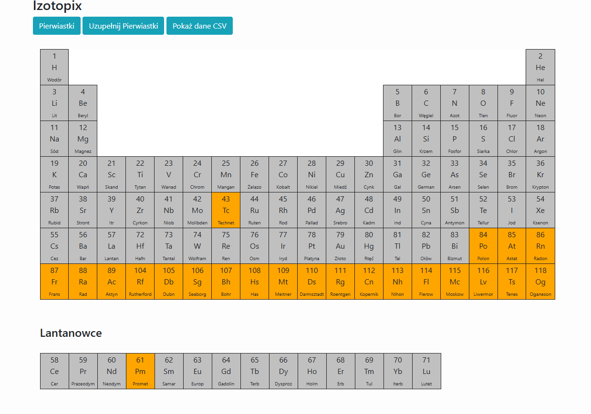

#Izotopix

Program na na celu obsługę programu mającego pomóc w nauce pierwiastków i izotopów.
Dodatkowo program będzie zawierał sprawdzenie hipotetycznych wyników zderzeń atomów w akceleratorach.
System będzie oparty o Laravel

 